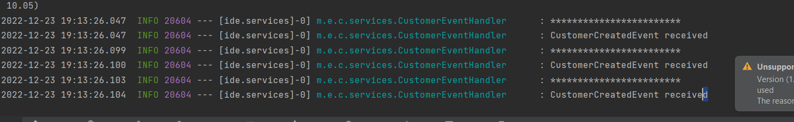
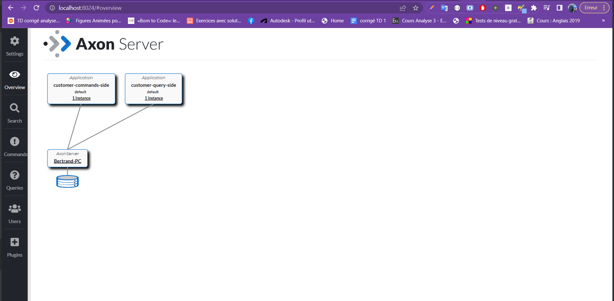
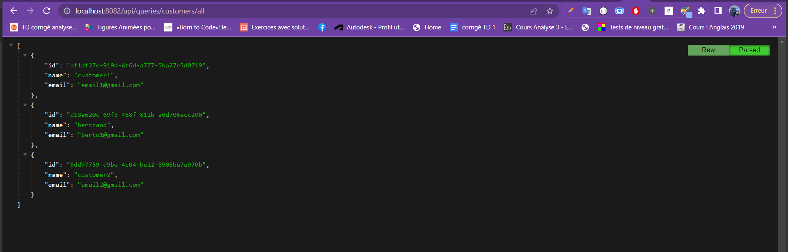

## Digital Banl project with Event Sourcing and CQRS Pattern with Axon Framework


### stack & packages

```
-lambock
-spring web & data jpa
-H2
-axon framework
-reactor-core
-kotlin
-open ui

```
-> Have a look : [📦 pom.xml ](./pom.xml)
<br>

### Config

```

```
-> Have a look : [📦 application.properties ](./src/main/resources/application.properties)


### App -Customer Micro -service

## I- Initiation

    . Create a maven project for common api as  module and declare it as dependency in main pom.xml

-> Have a look : [📦 core-api ](./core-api)
```

```
  <br>

   . Create a spring boot project for micro command side and Change in pom.xml project parent

-> Have a look: [📦 customer-command-side ](./customer-command-side)
```
   <parent>
        <artifactId>digital-bank-cqrs-axon</artifactId>
        <groupId>ma.enset</groupId>
        <version>3.0.1</version>
    </parent>
   
   -> don't forget to add dependency to core-api module
```
  <br>

   . Create a spring boot project for micro query side

->Have a look : [📦 customer-query-side ](./customer-query-side)
```
   <parent>
        <artifactId>digital-bank-cqrs-axon</artifactId>
        <groupId>ma.enset</groupId>
        <version>3.0.1</version>
       
    </parent>
-> don't forget to add dependency to core-api module
```
  <br>


                 Command Side


## II- Create of commands  and events on  core-api module 

-> Have a look : [📦 command ](./core-api/src/main/java/ma/enset/digitalbank/coreapi/commands)
```
package ma.enset.Customer.command;

import lombok.Getter;
import org.axonframework.modelling.command.TargetAggregateIdentifier;

//les commandes sont immutables
public class BaseCommand<T> {
    @TargetAggregateIdentifier
   @Getter private   T id;

    public BaseCommand(T id) {
        this.id = id;
    }
}
...

```

-> Have a look : [📦 event ](./core-api/src/main/java/ma/enset/digitalbank/coreapi/events)
```
package ma.enset.Customer.event

abstract class BaseEvent<T>(
        open val id : T
)
data class CustomerCreatedEvent(
        override val id: String,
        val name: String,
        val email: String
) : BaseEvent<String>(id)


data class CustomrUpdatedEvent(
        override val id: String,
        val  name: String,
        val email: String
): BaseEvent<String>(id)

```

<br>

## III- Create controller and aggregate

-> Have a look of controller : [📦 CustomerCommandController ](./customer-command-side/src/main/java/ma/enset/digitalbank/customercommandside/controller/CustomerCommandController.java)
```
@RestController
@RequestMapping("/api/commands/customers")
@AllArgsConstructor
public class CustomerCommandController {
    private CommandGateway commandGateway;

    @PostMapping("/create")
    public CompletableFuture<String> createCustomer(@RequestBody CreateCustomerCommandDTO request){
        CompletableFuture<String> response = commandGateway.send(new CreateCustomerCommandDTO(
                UUID.randomUUID().toString(),
                request.getName(),
                request.getEmail()
        ));
        return response;

    }
}
...
```

-> Have a look of aggregate : [📦 CustomerAggregate ](./customer-command-side/src/main/java/ma/enset/digitalbank/customercommandside/aggregates/CustomerAggregate.java)


## IV- Test of command side

-> download axon server from [here](https://axoniq.io/download)
-> run axon server with command : java -jar axonserver.jar
-> get access on localhost:8024


-> run customer command side with command : mvn spring-boot:run


```
launch Customer creation command:
curl -X POST \
  http://localhost:8080/api/commands/customers/create \
  -H 'Content-Type: application/json' \
  -d '{
    "name":"customer1",
    "email":"email1@gmail.com"
}'
```

<br>


                              Query Side


## V- Create  entities, repository service to Handler Events

-> Have a look of entities : [📦 Customer ](./customer-query-side/src/main/java/ma/enset/digitalbank/customerqueryside/entities/Customer.java)
```

@Entity
@Data
@NoArgsConstructor
@AllArgsConstructor
public class Customer {
    @Id
    private String id;
    private String name;
    private String email;
}

```

-> Have a look of repository : [📦 CustomerRepository ](./customer-query-side/src/main/java/ma/enset/digitalbank/customerqueryside/repositories/CustomerRepository.java)
```
@Repository
public interface CustomerRepository extends JpaRepository<Customer, String> {

}
```

-> Have a look of service : [📦 CustomerEventHandler ](./customer-query-side/src/main/java/ma/enset/digitalbank/customerqueryside/service/CustomerEventHandler.java)

```
//handle events for command side . call on boot
@Service
@Slf4j
@AllArgsConstructor
public class CustomerEventHandler {
    private CustomerRepository customerRepository;

    @EventHandler
    public void on(CustomerCreatedEvent event){
        log.info("************************");
        log.info("CustomerCreatedEvent received");
        Customer customer=new Customer();
        customer.setId(event.getId());
        customer.setName(event.getName());
        customer.setEmail(event.getEmail());
        customerRepository.save(customer);
    }


}

//handle query create  after .
```
<br>

     Test: we can see log of Events on console on boot



      on axon dashboard



<br>


## VI -Create controllers and Other Event Handler to create and hande query

-> Have a look of controller : [📦 CustomerQueryController ](./customer-query-side/src/main/java/ma/enset/digitalbank/customerqueryside/controller/CustomerQueryController.java)
```
-> don't forget to add query on core-api module  : [📦 query ](./core-api/src/main/java/ma/enset/digitalbank/coreapi/queries)
@RestController
@RequestMapping("/api/queries/customers")
@AllArgsConstructor
public class CustomerQueryController {
    private QueryGateway queryGateway;
    
    @GetMapping
    public CompletableFuture<List<Customer>>customers(){
        return queryGateway.query(new GetAllCustomersQuerry(), ResponseTypes.multipleInstancesOf(Customer.class));
    }
}
....

```
-> Have a look of CustomerQueryHandler : [📦 CustomerQueryHandler ](./customer-query-side/src/main/java/ma/enset/digitalbank/customerqueryside/handler/CustomerQueryHandler.java)
```

@Service
@Slf4j
@AllArgsConstructor
public class CustomerQueryHandler {
    public CustomerRepository customerRepository;

    @QueryHandler
    public List<Customer> customerList(GetAllCustomersQuery query){
        return customerRepository.findAll();
    }
    @QueryHandler
    public Customer customerList(GetCustomerByIdQuery query){
        return customerRepository.findById(query.getId())
                .orElseThrow(()->new RuntimeException("Customer not fount"));
    }
}

```
<br>

     Test result on web 




<br>

                              Error


### Error Found on project dev

1.   maven error using intellij is referencing itself
     solution: [??](https://stackoverflow.com/questions/6481627/maven-error-using-intellij-is-referencing-itself)

2.Web server failed to start. Port 8080 was already in use. Action:Identify and stop the process that's listening on port 8080 or configure this application to listen on another port.
