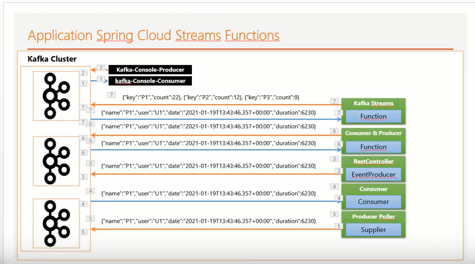

# Even Driven Distributed Processing With Spring Cloud Stream Functions - KAFKA Broker

<p align="center">
  
</p>

### Getting Started

* download kafka broker from https://kafka.apache.org/downloads
* unzip the downloaded file
* go to the kafka directory and start the zookeeper and kafka broker

```
bin/zookeeper-server-start.sh config/zookeeper.properties
bin/kafka-server-start.sh config/server.properties
```
* Test the kafka broker with kafka console producer and consumer
``` 
kafka-console-consumer
> bin\windows\kafka-console-consumer.bat --bootstrap-server localhost:9092 --topic R1

kafka-console-producer
> bin\windows\kafka-console-producer.bat --broker-list localhost:9092 --topic R1

> producesome messages

```


#### Stack && Packages

```
- spring-boot-starter-web
- spring for Apache Kafka
- spring for Apache Kafka Streams
- spring-cloud-stream
- lombok

```

### config


### App

 * Create a Rest Controller producer poller

```
@RestController
@AllArgsConstructor
public class PageEventRestController {
    private final StreamBridge streamBridge;
    @GetMapping("/publish/{topic}/{name}")
    public PageEvent publish(@PathVariable String topic, @PathVariable String name) {
        PageEvent pageEvent = new PageEvent(name, Math.random()>0.5?"U1":"U2", new Random().nextInt(9000), new java.util.Date());
        streamBridge.send(topic, pageEvent);
        return pageEvent;
    }

}
```

* Create a  service Kafka consumer  /IN

```
@Service
public class PageEventService {
    // le framework fait le suscribe automatiquement
    @Bean
    public Consumer<PageEvent> pageEventConsumer(){
        return (input) -> {
            System.out.println("**************");
            System.out.println(input.toString());
            System.out.println("**************");
        };
    }
}
```

* Create a service Suplier /OUT

```
@Bean
    public Supplier<PageEvent> pageEventSupplier (){
        return () -> new PageEvent(Math.random()>0.5?"P1":"P2", Math.random()>0.5?"U1":"U2", new Random().nextInt(9000), new java.util.Date());
    }
```
> config event frequency on application.properties

```
spring.cloud.stream.poller.fixed-delay=1000
```

* Create  services Function = Consumer & Producer /IN-OUT

```
