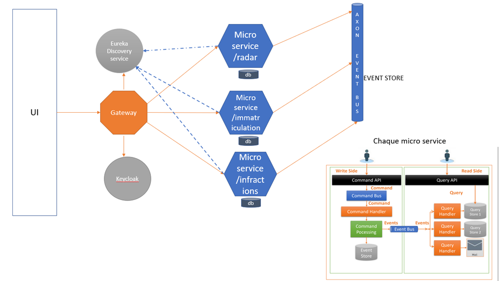
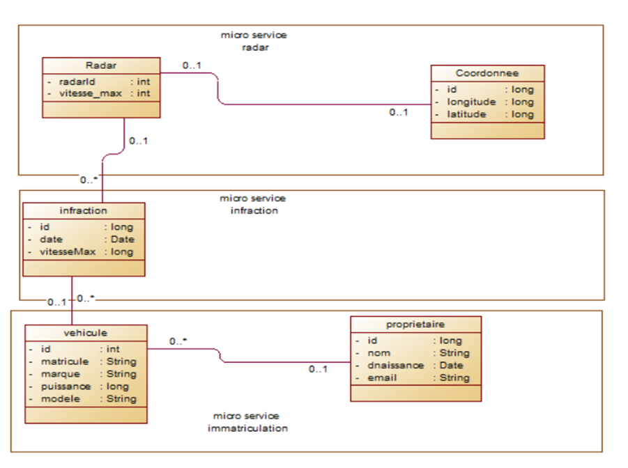

##  Examen Systèmes Distribués:
<br>
    
    On souhaite créer un système distribué basé sur les micro-services en utilisant une architecture pilotée
    par les événements respectant les deux patterns Event Sourcing et CQRS. Cette application devrait
    permettre de gérer les infractions concernant des véhicules suites à des dépassement de vitesses
    détectés par des radars automatiques.

<br>

### 1. Etablir une architecture technique du projet
<p align="center">
    
</p>


### 2. un diagramme de classe global
<p align="center">
    
</p>


### 3- initialisation  du projet : creation des modules avec leur dependances

[👉 Creation de mock-exam-radar ] 

```
C'est le projet central
```
> [stacks & packages](./pom.xml)
```
    -spring web
    -spring data jpa
    -h2
    -lambock
    -axon framework
    -kotlin
    -eureka discovery service
 ```
    
> [configuration](./src/main/resources/application.properties)
```
...
```
<br>
<br>
<br>
<br>
<br>


[👉 Creation de common-api ](./common-api)

 ```
 un projet Maven contenant les différents elements communs des micro services DTOS,Events,...
 ```
>[stacks && packages](./common-api/pom.xml)
```
-project mock-exam-radar as parent
```

<br>
<br>
<br>
<br>
<br>


[👉 Creation du microservice radar-service ](./radar-service)
 ```
Le micro-service qui permet de gérer les radars.
 ```
>[stacks && packages](./radar-service/pom.xml)
```
-project mock-exam-radar as parent
-comman-api 
```

> [configuration](./radar-service/src/main/resources/application.properties)
```
...

```

>[radar-service-command-side](./radar-service/radar-command-side) 
```
-8081
-radar-service as parent
```

>[radar-service-query-side](./radar-service/radar-query-side)
```
-8082
-radar-service as parent
```

<br>
<br>
<br>
<br>
<br>

[👉 Creation du microservice registration-service ](./registration-service)
<br>

```
Le micro-service d’immatriculation qui permet de gérer des véhicules appartenant des propriétaires.
 ```
>[stacks && packages](./registration-service/pom.xml)
```
-project mock-exam-radar as parent
-comman-api 
```

> [configuration](./registration-service/src/main/resources/application.properties)
```
...

```

>[registration-service-command-side](./registration-service/registration-command-side)
```
-8083
-registration-service as parent
```

>[registration-service-query-side](./registration-service/registration-query-side)
```
-8084
-registration-service as parent
```

<br>
<br>
<br>
<br>
<br>

[👉 Creation du microservice contravention-service ](./contravention-service)
<br>

```
Le micro-service d’immatriculation qui permet de gérer des véhicules appartenant des propriétaires.
 ```
>[stacks && packages](./contravention-service/pom.xml)
```
-project mock-exam-radar as parent
-comman-api 
```

> [configuration](./contravention-service/src/main/resources/application.properties)
```
...

```

>[contravention-service-command-side](./contravention-service/registration-command-side)
```
-contravention-service as parent
```

>[contravention-service-query-side](./contravention-service/registration-query-side)
```
-contravention-service as parent
```
