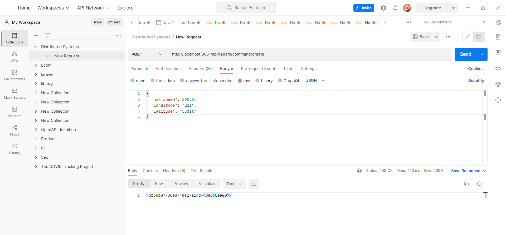
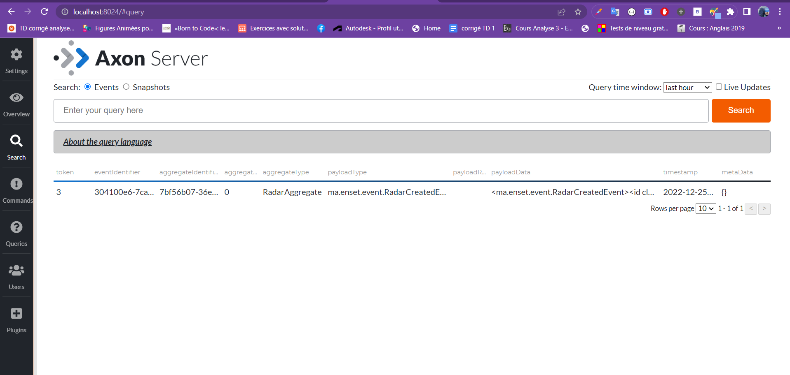
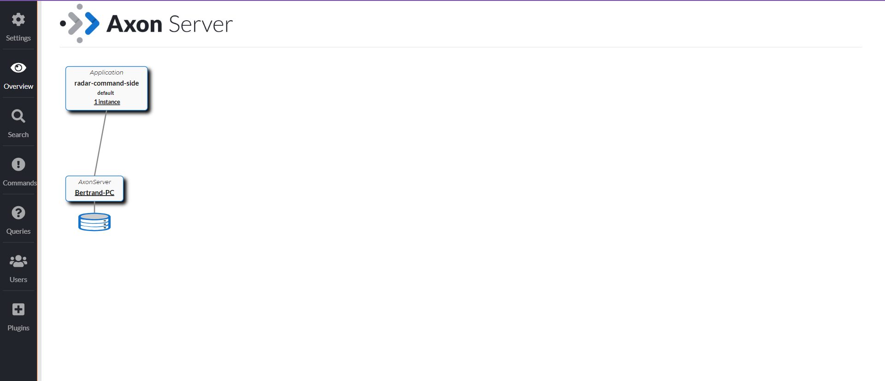
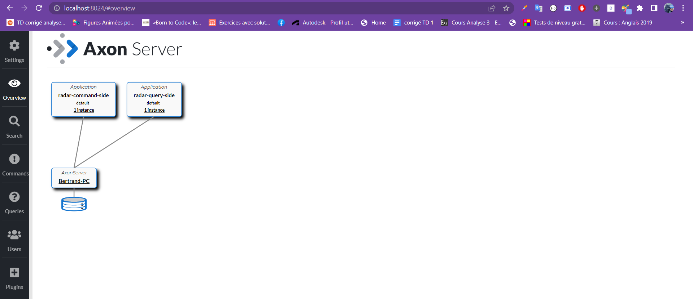
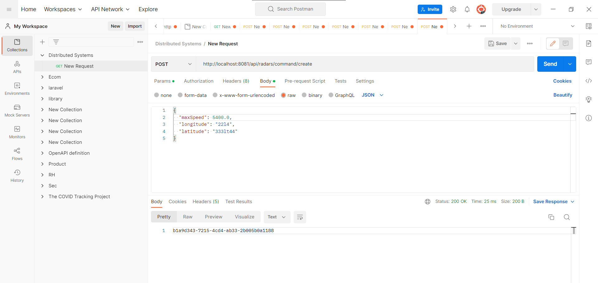
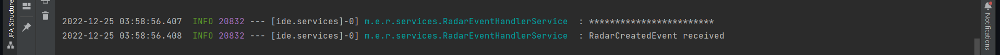
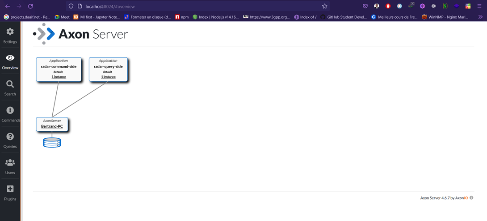
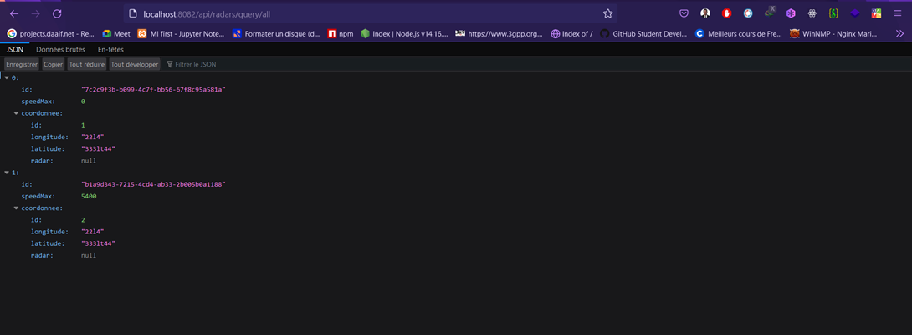
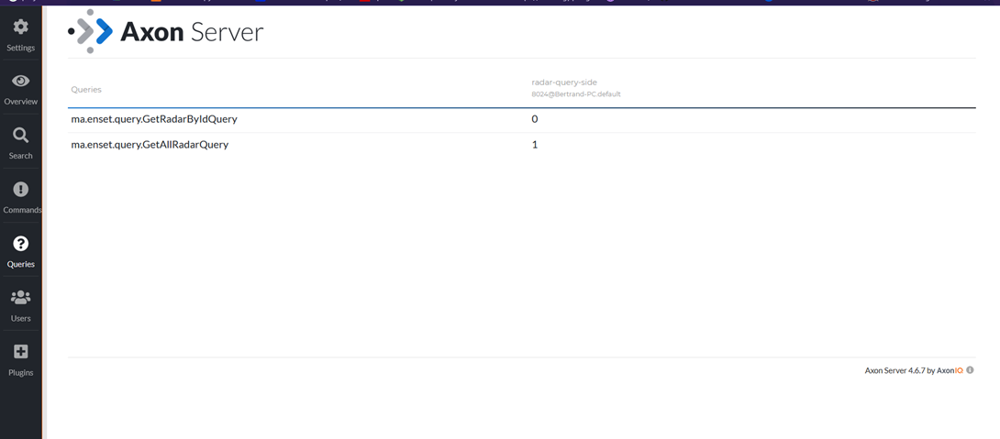

## Creation du microservice radar-service

    1-Command side
 

[🎩  see here](./radar-command-side)

> Test on postman 

        1-Query side

 

[🎩  see here](./radar-query-side)

    command Event Handling

    RadarQueryHandling

